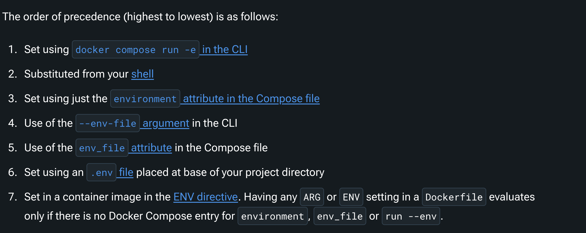

# 240310

## docker-compose .env file

도커 컨테이너가 실행 중일 때 사용할 환경변수를 .env파일(text file)에 key-value 쌍으로 지정할 수 있다.

[도커 컴포즈 .env 파일](https://docs.docker.com/compose/environment-variables/set-environment-variables/)

## spring boot + docker-compose

docker-compose.yml에서 service를 정의할 수 있다. 이 때 service의 환경 변수를 설정할 수 있다.

spring boot 도커 이미지를 사용할 때 이미지, spring profile 등의 값을 .env 파일에서 읽어와 설정할 수 있다.

```yml
version: 'version 1.0.0'

services:
  app:
    image: ${DOCKER_IMAGE}
    # 생략
    environment:
      SPRING_PROFILES_ACTIVE: ${SPRING_PROFILES_ACTIVE}
      BINANCE_APIKEY: ${BINANCE_APIKEY}
      BINANCE_APISECRET: ${BINANCE_APISECRET}
      MONGODB_URI: ${MONGODB_URI}
```

[스프링 부트 & 도커 컴포즈](https://spring.io/blog/2023/06/21/docker-compose-support-in-spring-boot-3-1)


## github action의 secret 변수를 외부 클라우드 환경으로 옮기기

github action에서 작업(Jobs, Steps)을 통해 github repository에 secret으로 설정한 값들을 복사해서 외부 클라우드 컴퓨터로 옮길 수 있다.

format을 활용하면 workflow_dispatch의 기능을 활용해 github cli를 통해 입력한 변수(github.event.inputs.<변수명>)에 따라 github repository의 secret 값을 고를 수 있다.

secret 값을 가져왔다면 scp 프로토콜을 통해서 파일을 외부 클라우드 컴퓨터로 전송하면 된다.

```yml
      - name: Create .env file
        run: |
          echo "DOCKER_IMAGE=${{ secrets[format('{0}_DOCKER_IMAGE', github.event.inputs.profile)] }}" >> .env
          echo "SPRING_PROFILES_ACTIVE=${{ github.event.inputs.profile }}" >> .env
          echo "BINANCE_APIKEY=${{ secrets[format('{0}_BINANCE_APIKEY', github.event.inputs.profile)] }}" >> .env
          echo "BINANCE_APISECRET=${{ secrets[format('{0}_BINANCE_APISECRET', github.event.inputs.profile)] }}" >> .env
          echo "MONGODB_URI=${{ secrets[format('{0}_MONGODB_URI', github.event.inputs.profile)] }}" >> .env

      - name: Copy .env file to EC2
        env:
          SSH_HOST: ${{ secrets[format('{0}_SSH_HOST', github.event.inputs.profile)] }}
          SSH_USER: ${{ secrets[format('{0}_SSH_USER', github.event.inputs.profile)] }}
          SSH_PEM_KEY: ${{ secrets[format('{0}_SSH_PEM_KEY', github.event.inputs.profile)] }}
        run: |
          echo "$SSH_PEM_KEY" > $HOME/key.pem
          chmod 400 $HOME/key.pem
          scp -i $HOME/key.pem -o StrictHostKeyChecking=no .env $SSH_USER@$SSH_HOST:~/
          rm -f $HOME/key.pem
```

[깃허브 액션 workflow_dispatch input](https://docs.github.com/en/enterprise-cloud@latest/actions/using-workflows/workflow-syntax-for-github-actions#onworkflow_dispatchinputs)


[scp](https://ko.wikipedia.org/wiki/%EC%8B%9C%ED%81%90%EC%96%B4_%EC%B9%B4%ED%94%BC)

## docker-compose env 적용 우선 순위를 고려해 docker 컨테이너에서 환경변수가 적절하게 주입됬는지 디버깅

[우선 순위](https://docs.docker.com/compose/environment-variables/envvars-precedence/)



혹시나 환경변수를 확인했는데 적용이 이상하다고 느끼면 우선 순위가 높은 환경 변수를 확인해야 한다.

### 우선 순위 6의 .env 파일로 설정된 환경 변수 확인 방법

우선 컨테이너에 환경변수가 적절하게 설정됬는지 확인함

아래 명령어를 통해서 컨테이너의 환경변수를 확인할 수 있음

```shell
docker-compose exec app env
```

```shell
docker exec <container-id or name> env
```

[도커 exec](https://docs.docker.com/reference/cli/docker/compose/exec/)

그리고 어플리케이션 로그에서 적절하게 프로필이 선택됬는지, DB uri는 어디에 붙었는지 확인하면 된다.

```shell
docker logs <container id>
```

[도커 컨테이너 로그](https://docs.docker.com/reference/cli/docker/container/logs/)

## Linux에서 application-{profile}.properties은 case-sensitve 

https://stackoverflow.com/questions/48408168/spring-batch-with-active-profile-still-looks-for-application-properties

그래서 대문자에서 소문자로 바꿔주는 처리 github action yaml에 추가해도 되지만 그냥 application properties에 profile 값을 모두 대문자로 바꾸겠습니다.

https://stackoverflow.com/questions/2264428/how-to-convert-a-string-to-lower-case-in-bash
